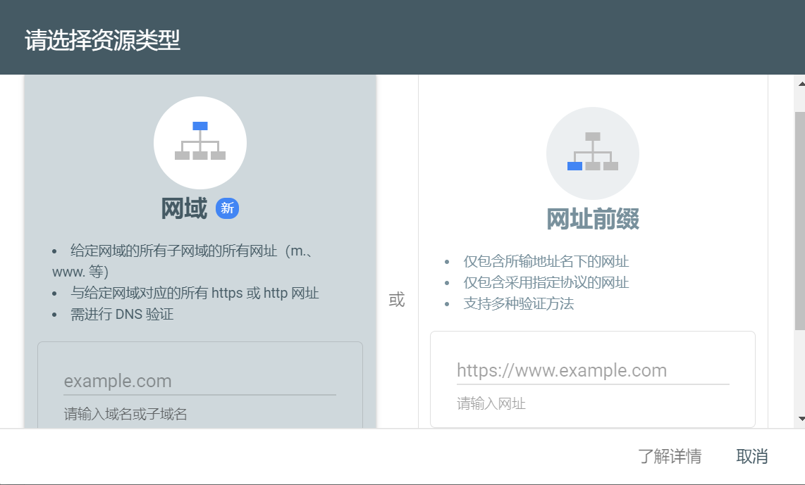
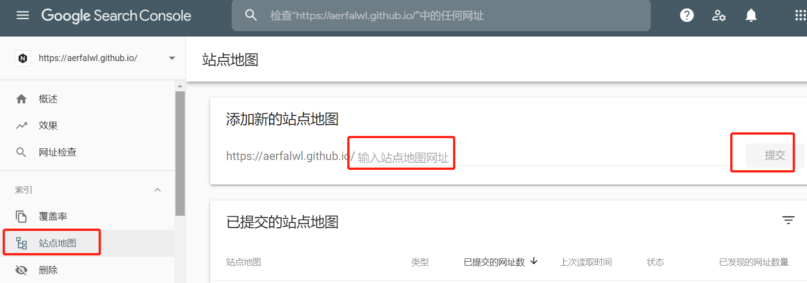

## 步骤
1. 生成站点地图

   ```shell
   npm install hexo-generator-sitemap --save
   ```

2. 修改配置文件_config.yml，添加如下内容：

   ```shell
   sitemap:
     path: sitemap.xml
   ```

3. 修改_config.xml，设置url为你的github.io

   ```xml
   url: https://xxx.github.io
   ```

   

4. 添加站点，登录[Google 网站站长](https://www.google.com/webmasters/)，进入```Search Console```，进入如下页面

   

5. 选择网址前缀，输入https://xxx.github.io

6. 之后，下载Google验证文件，放在```theme/next/source```目录中。

7. 重新生成和部署

   ```shell
   hexo clean && hexo generate && hexo deploy
   ```

7. 部署完成之后，进行验证即可，若操作无误，便会验证成功。

8. 添加站点地图：

   

9. 大功告成，几个小时后，便能在google search中搜到自己的博客！

   