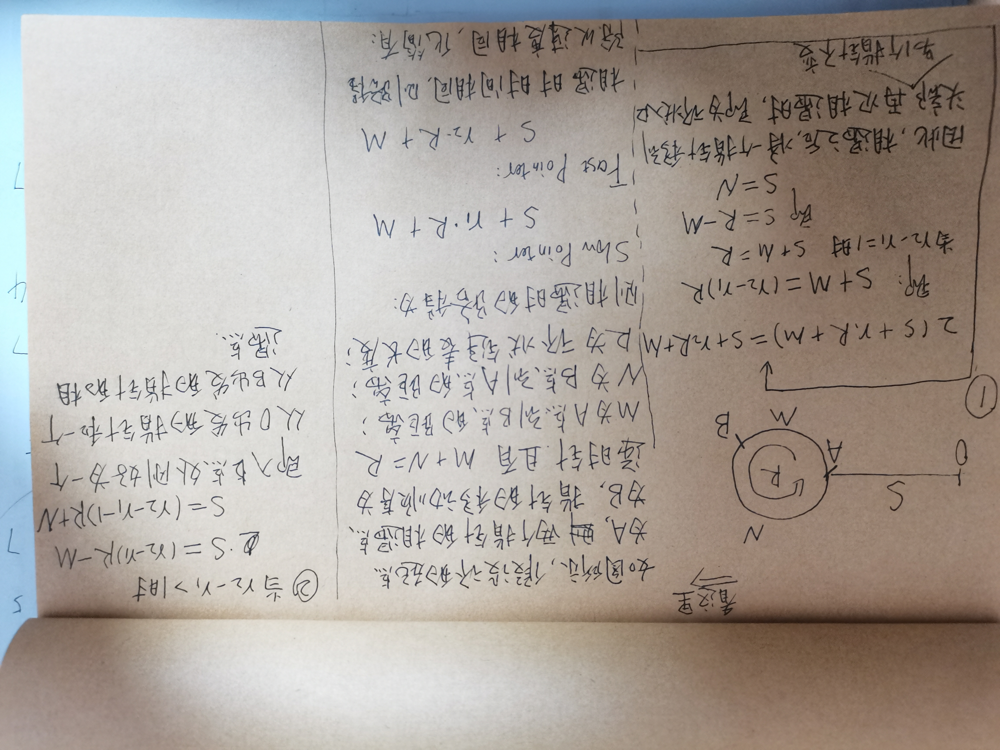

## 题目描述

[英文题目](https://leetcode.com/problems/linked-list-cycle-ii/)

[中文题目](https://leetcode-cn.com/problems/linked-list-cycle-ii/)

难度：中等

### 题意

简单来说，就是判断一个链表是否有环，如果有的话，返回环的起点。

### 解题思路

该题目分类属于中等题，且用two pointer进行解决。该问题可以拆解为两个子问题：

#### 如何判断一个链表是否有环

这个问题比较简单，我们设置一快一慢两个指针，快指针每次走一步，慢指针每次走两步，则如果时间充裕，两个指针一定会相遇。

该问题类似于小学题目中的追击问题：操场上两个同学的跑步，一个同学的速度是`x`，另一个同学的速度是`y`，假设`x>y`，则最快多长时间两个人可以相遇？答案是`s/(x-y)`，且初次相遇时两者路程差一定是`S`。判断链表有环时，其实不能完全套用这个问题，因为两个人跑步时，操场上所有的点都是它们可以相遇的点，但是链表问题中，环上只有几个点可以是它们相遇的点，因此，初次相遇时，两者的路程差不一定是`S`，而是可能是`nS`，但是可以证明它们一定是可以相遇的。

#### 如何判断环的起点

证明如下图所示：



看不懂没关系，记住下面的技巧即可：

简单来说：两个指针相遇之后，将快指针放回原点，慢指针位置不变，两者都以慢指针的速度遍历节点。则再次相遇时，便是环的起点。

**代码如下：**

```java
/**
 * Definition for singly-linked list.
 * class ListNode {
 *     int val;
 *     ListNode next;
 *     ListNode(int x) {
 *         val = x;
 *         next = null;
 *     }
 * }
 */
public class Solution {
    public ListNode detectCycle(ListNode head) {
        ListNode slow = head;
        ListNode fast = head;
        boolean flag = false;
        while (slow != null && fast != null && fast.next != null) {
            slow = slow.next; // 一次走一步
            fast = fast.next.next; // 一次走两步
            if (slow == fast) {
                flag = true;
                break;
            }
        }
        if (flag == false) return null;
        fast = head; // 快指针放回起点
        while (fast != slow) { 
            fast = fast.next; // 以相同速度前进 
            slow = slow.next; // 以相同速度前进 
        }
        return slow; // 交点即环的起点
        
    }
}
```

### 总结

1. 两个指针：慢指针和快指针，慢指针一次走一步，快指针一次走两步。如果两个指针相遇，就是有环，如果两个指针不相遇，就是没环。
2. 将快指针放回链表起点，慢指针位置不变，两者都以慢速遍历指针，再次相遇的点即为环的起点。